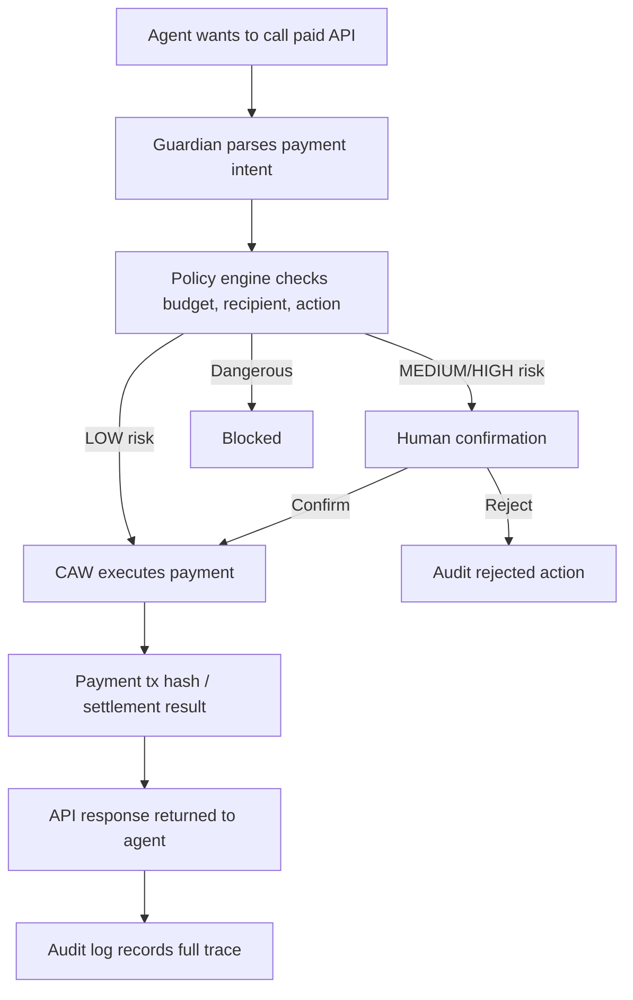

# 每日学习打卡

> 2026-06-01 · Week 3 · Safe Session Key 实验 + Guardian Agent Wallet / Cobo CAW 赛道适配

---

## 一、Safe 部署脚本实测

今天在 Anvil Base L2 fork 上跑通了 `deploy-safe.ts`，完整验证了 Agent Wallet 的「提案-确认」模式。

### 环境搭建

- Foundry v1.7.1 安装完成，包括 anvil / forge / cast / chisel；
- Anvil fork：Base L2 @ block 30000000，chainId 8453；
- protocol-kit v5 import 修复：ESM 默认导出需要通过 `pkg.default` 获取。

### Phase 1：Safe 智能账户部署

| 字段 | 值 |
| --- | --- |
| Safe 地址 | `0x7f41754E7bb5De97c3B26a65dC9404Cd21d8a565` |
| 部署 tx | `0x61c0c83b92e928f093c3e72133def80057e6d055676408b354a6c81c61b799c1` |
| 区块 | 30000001 |
| 所有者 | 1/1 单签 |

### Phase 3：提案-确认模式

```text
Agent 构建提案 -> 人签名 -> Safe 执行
       |              |          |
createTransaction  signTx   executeTx
```

| 字段 | 值 |
| --- | --- |
| 转账金额 | 0.01 ETH -> `0x7099...79C8` |
| 执行 tx | `0x486ddeeb6f91e0e0e3e0d43a6e80d3abf5aa74262af8d353772a3506cd5769d9` |
| Gas | 83,310 |
| Safe 余额 | 0.09 ETH，来自 0.1 转入 - 0.01 转出 |

### Phase 4：Session Key 与 AllowanceModule 映射

Safe 生态中 Session Key 的四个约束都有链上对应：

- **限额**：`setAllowance(delegate, token, amount, resetTime)`
- **时效**：`resetTimeMin` + `removeDelegate()`
- **白名单**：每个 token 独立 allowance，没有 allowance 的 token 不能花
- **可撤销**：`removeDelegate()` 一键 kill switch，不需要 delegate 同意

### 今天踩到的坑

1. Anvil fork 需要代理访问 Base RPC，纯本地链没有 Safe 合约部署地址；
2. protocol-kit v5 ESM 导入 `import Safe from "..."` 拿不到类，需要使用 `pkg.default`；
3. `createSafeDeploymentTransaction` 依赖 `safe-deployments` 包里有对应 chainId 的合约地址。

---

## 二、Guardian Agent Wallet 当前进展

今天也围绕 **Guardian Agent Wallet** 项目，判断它是否符合 Cobo Agentic Wallet 赛道要求，并明确下一步从 mock demo 升级到可提交 demo 的路径。

当前项目已经完成了一个本地可运行的安全钱包产品原型：

- 用户输入 agent 想执行的链上动作；
- `intentParser` 解析 swap / transfer / approve 等意图；
- `policyEngine` 根据预算、收款方、授权类型做风险判断；
- UI 展示 `ALLOW / CONFIRM / DENY`；
- 低风险操作可以执行 mock transaction；
- 高风险操作需要人工确认；
- 危险操作直接阻断；
- 所有执行结果写入本地 audit log。

这说明项目方向是对的：它不是单纯做钱包，也不是单纯做 AI 聊天，而是在解决 **Agent 接触资金时如何被约束、确认、审计和执行** 的问题。

---

## 三、对 Cobo 赛道要求的判断

Cobo 赛道的核心要求是：项目必须围绕 **Agent 与资金操作场景** 展开，并且资金相关操作需要通过 **Cobo Agentic Wallet (CAW)** 完成。

根据今天的判断，当前项目状态如下：

| 赛道要求 | 当前项目状态 | 结论 |
| --- | --- | --- |
| 围绕 Agent 与资金操作场景 | 已围绕 agent payment / transfer / approve 设计 | 部分符合 |
| 体现权限控制和安全边界 | 已有 policy、人工确认、deny、audit log | 部分符合 |
| Agent 具备真实资金执行能力 | 当前仍是 mock wallet | 不符合 |
| 使用 Cobo Agentic Wallet | 当前还没有接入 CAW | 不符合 |
| 可运行产品 Demo | 本地 Next.js demo 可运行 | 部分符合 |
| 提供 CAW 关键代码或配置 | 当前没有 | 不符合 |
| 提供测试网地址、tx hash、agent wallet 地址 | 当前没有 | 不符合 |

所以今天的结论是：

> Guardian Agent Wallet 当前是一个合格的赛道原型基础，但还不是最终可提交版本。要符合 Cobo 赛道，必须把 mock wallet execution 替换或扩展为 CAW 测试网真实执行。

---

## 四、推荐选择的赛道方向

在 Cobo 给出的几个方向里，我认为当前项目最适合切入：

## 01｜Agent-Native Payments

这个方向的目标是让 Agent 成为互联网的一等支付公民，可以在授权范围内自动完成支付、购买 API、购买数据或调用付费服务。

当前项目天然适配这个方向，因为它已经有：

- agent action 输入；
- payment / transfer / approve intent；
- policy 判断；
- 低风险自动执行；
- 高风险人工确认；
- 危险操作拒绝；
- audit trail。

只要下一步接入 CAW，就可以形成一个更完整的闭环：



---

## 五、今天的重要认知

### 1. Mock demo 和赛道 demo 的差别

Mock demo 可以证明产品逻辑成立，但赛道 demo 需要证明资金流程真实发生。

也就是说：

- 当前 demo 证明了 **应该如何判断风险**；
- 但还没有证明 **Agent 真的能通过 CAW 管钱和花钱**。

这是当前项目最大的缺口。

### 2. CAW 不能只是展示元素

Cobo 的评审重点里明确提到：CAW 需要是资金流程里的关键组件，而不是可替换的 UI 装饰。

因此后续不能只在 README 写“未来接入 CAW”，而是要让核心路径真的经过 CAW：

- agent wallet 由 CAW 管理；
- 支付、转账或结算由 CAW 发起；
- 权限边界通过 CAW / policy / spending limit 表达；
- audit log 记录 CAW 执行结果。

### 3. 当前项目的优势是安全边界

很多 Agent payment 项目可能只强调“自动付款”，但 Guardian Agent Wallet 的差异点是：

> 自动付款不是目标，受控、可解释、可撤销、可审计的自动付款才是目标。

这和我想做的“安全钱包”方向一致。

### 4. Safe 与 CAW 的关系

Safe 实验让我更清楚一件事：Agent 钱包安全并不是一个单点功能，而是一套权限结构。

Safe / Session Key 更偏向链上账户与执行权限模型；CAW 更贴近 Agentic Commerce 场景下的 agent 资金账户和执行入口。Guardian Agent Wallet 可以把两者抽象成同一层产品语言：

```text
AI explains.
Policy decides.
Wallet executes.
Human confirms.
Audit records.
```

---

## 六、项目定位更新

今天把项目定位进一步收敛为：

> Guardian Agent Wallet is a CAW-powered policy layer for safe agent payments.

中文表达：

> Guardian Agent Wallet 是一个面向 Agent 自主支付的安全钱包层：AI 负责解释意图，Policy 负责判断边界，CAW 负责真实执行，Human 负责高风险确认，Audit 负责记录证据。

对应五句话：

```text
AI explains.
Policy decides.
CAW executes.
Human confirms.
Audit records.
```

---

## 七、深度知识补充：Few-shot & Chain-of-Thought

### Few-shot Prompting

给 Agent 几个示例，让它学会“怎么做”，而不是只告诉它“做什么”。

| 类型 | 做法 | 适用 |
| --- | --- | --- |
| Zero-shot | 不给示例，直接问 | 简单任务 |
| One-shot | 给 1 个示例 | 格式固定 |
| Few-shot | 给 3-5 个示例 | 复杂推理 / 分类 |

Web3 场景里，让 Agent 解释交易风险时，如果给 2-3 个范例，例如正常转账、approve 无限额、调用陌生合约，Agent 输出的风险等级会更稳定。

主要风险是：示例太多会占用上下文；示例有偏见会让 Agent 学到错误模式。

### Chain-of-Thought (CoT)

CoT 的价值是让 Agent 在给结论前先按步骤检查。

```text
这个提案该不该通过？请一步一步分析：
1. 提案金额是否在预算内？
2. 收款地址是否在白名单？
3. 调用的合约是否已知？
4. 综合判断：通过 / 拒绝 / 需人工确认。
```

Web3 链上操作不可逆，CoT 能让 Agent 在“动手”前先过一遍安全检查清单。但在真实产品里，不应该把 CoT 作为唯一安全机制，最终仍然要靠 policy、wallet guard、权限边界和人工确认来兜底。

---

## 八、深度知识补充：Agent 错误处理

### 错误分类三层

| 层 | 例子 | 策略 |
| --- | --- | --- |
| 可恢复 | RPC 超时、API 限流 | 重试 + 退避 |
| 需降级 | 工具不可用、模型切换 | 换工具 / 换模型 |
| 必须停 | 超预算、未知合约、权限不足 | fail closed + 通知人 |

### 重试策略

```text
简单重试：失败 -> 等一下 -> 再试，最多 N 次
指数退避：失败 -> 等 1s -> 等 2s -> 等 4s -> 放弃
断路器：连续失败 M 次 -> 暂停一段时间 -> 再试一次
```

Web3 场景有几个特殊规则：

- 交易已广播但 pending 时，不要盲目重发，避免重复交易；
- RPC 返回 error 时，先确认 nonce、交易状态和链上结果；
- 合约 revert 通常不要直接重试，因为相同输入大概率仍会失败。

### Fail Closed vs Fail Open

```text
Fail Open  = 出错了继续，风险大，不适合 Web3 资金场景
Fail Closed = 出错了停止，默认策略
```

Guardian Agent Wallet 的原则应该是：

> 所有链上资金动作默认 fail closed。Agent 不确定的时候，停下来，问人。

---

## 九、下一步开发计划

### Week 3 最小目标

把当前 mock demo 升级为一个可以展示 CAW 价值的最小可运行 demo。

计划拆成四步：

1. 阅读 CAW SDK / Recipes / Quickstart，确认测试网执行方式；
2. 新增 `lib/cawWallet.ts`，保留 `mockWallet.ts` 作为 fallback；
3. 在 UI 中增加 execution mode：`Mock` / `CAW Testnet`；
4. 完成一条小额测试支付，并在 audit log 里记录：
   - agent wallet address；
   - recipient；
   - amount；
   - chain；
   - tx hash；
   - policy decision；
   - timestamp。

### 最小可演示流程

```text
输入：买 10 USDC 的 ETH / pay 0.1 USDC to x402-service
解析：agent wants to pay for a protected API
判断：amount <= budget, recipient allowlisted
执行：CAW sends testnet payment
结果：显示 tx hash and audit log
返回：agent receives protected API response
```

---

## 十、风险和边界

后续接入真实 CAW 时，必须保留以下边界：

- 不接主网资金；
- 不使用真实大额资产；
- 不暴露私钥或 API key；
- 默认只允许 allowlisted recipient；
- unlimited approval 永远 deny；
- 超预算必须人工确认；
- suspicious recipient 必须人工确认或拒绝；
- 所有执行都要留下 audit record；
- README 必须写清楚这是测试网 demo。

---

## 十一、今天的结论

今天确认了两个关键判断：

1. Safe / Session Key / AllowanceModule 说明 Agent 钱包可以用成熟权限模型来约束执行，而不是重新发明一套钱包；
2. Guardian Agent Wallet 的方向是正确的，但当前还停留在 mock safety layer。要进入 Cobo 赛道提交状态，下一步必须接入 CAW，让 Agent 在受控权限内完成至少一次真实测试网资金执行。

最终项目价值不是“做一个钱包”，而是做一个 **Agent 资金操作前的安全决策层和执行边界层**。
