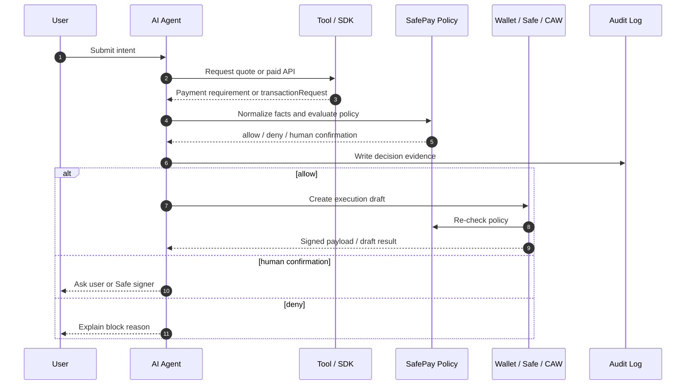

# Proposal Memo - SafePay Guard Wallet

## Summary

SafePay Guard Wallet is a safety layer for agent-initiated wallet actions. It focuses on the moment before execution: the agent has proposed an action, a tool has returned transaction data or a payment requirement, and the wallet must decide whether to sign, reject, or ask a human.

## User Story

```text
As a Web3 user, I want my AI agent to help me call paid APIs, bridge assets, or prepare contract interactions, but I do not want the agent to have unrestricted signing power.
```

## Concrete Scenario

A user asks:

```text
Call this paid AI contract-review API. If it costs no more than 0.10 USDC and the provider is approved, pay automatically.
```

The API returns an x402 payment requirement:

- network: Base
- asset: USDC
- amount: 0.10
- recipient: approved provider treasury
- resource: approved API endpoint

SafePay Guard Wallet checks the policy. If all checks pass, it creates a payment payload or wallet execution draft. If the amount is too high, recipient is unknown, resource changed, or approval is required, it asks the user or Safe signer for confirmation.

## Why It Is AI x Web3

It is not pure AI because execution safety depends on wallet infrastructure, policy enforcement, onchain receipts, and revocation.

It is not pure Web3 because users need AI to translate complex transaction facts into understandable risk explanations.

## MVP Features

### 1. Intent and Fact Normalization

Input:

- user prompt
- x402 payment requirement
- LI.FI quote / transaction request
- contract call draft

Output:

- chain
- token
- amount
- recipient
- contract
- method
- resource
- slippage
- approval flag

### 2. Policy Engine

Checks:

- chain allowlist
- token allowlist
- recipient allowlist
- API resource allowlist
- max amount per transaction
- daily budget
- method allowlist / denylist
- human confirmation threshold
- simulation status

### 3. Risk Explainer

The AI explains:

- what the action does
- why it is allowed / denied / escalated
- which policy checks passed or failed
- what evidence was recorded

### 4. Execution Draft

The MVP creates:

- x402 payment payload draft
- Safe transaction draft
- ERC-4337 UserOperation-like draft

Real signing can be disabled or limited to test environments.

### 5. Audit Log

Records:

- user intent
- normalized facts
- policy decision
- human confirmation if any
- transaction / settlement hash
- response hash
- failure reason

### 6. Attack Simulation

Simulates:

- prompt injection
- oversized payment
- unknown recipient
- wrong resource
- wrong chain
- unlimited approval
- forged tool return
- replayed payment payload

## Demo Flow



## Validation

MVP is successful if:

- normal low-risk payment is allowed;
- oversized payment is blocked;
- unknown recipient is blocked;
- wrong resource is blocked;
- unlimited approval is blocked;
- policy changes require human confirmation;
- every result includes verification evidence.

## Long-term Vision

SafePay Guard Wallet can become a reusable policy and explanation layer for agentic Web3 execution:

- x402 paid API calls;
- LI.FI bridge / swap execution;
- DAO treasury checklist;
- Safe module / guard policies;
- ERC-4337 UserOperation risk review;
- CAW / Pact-style agent permissions.

