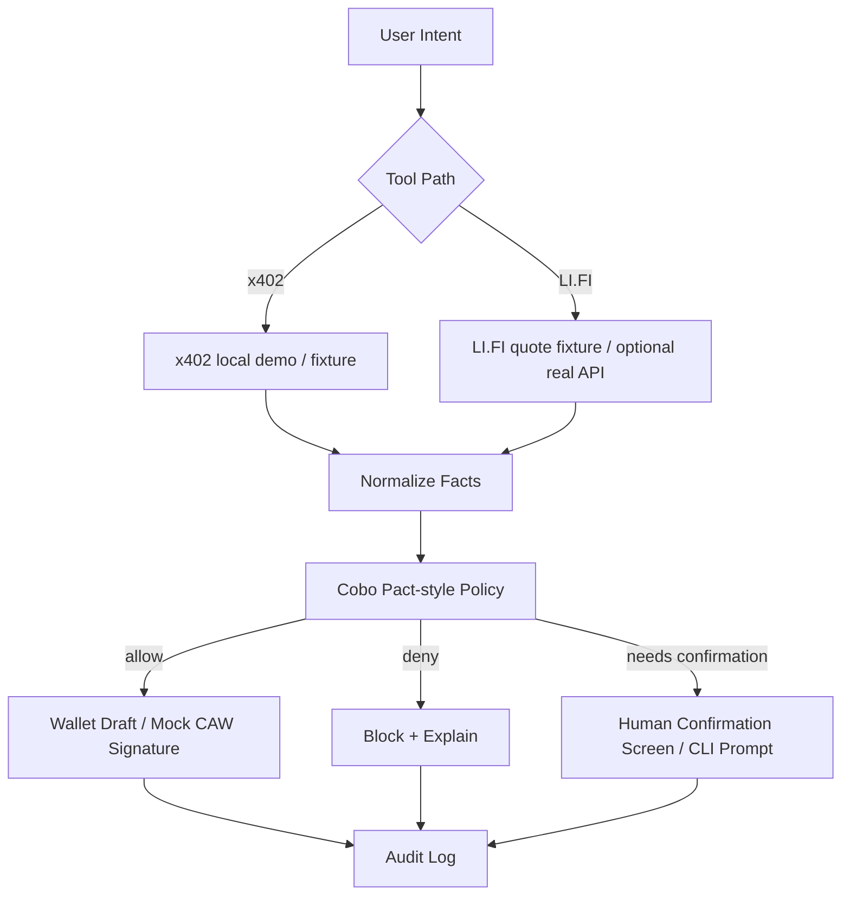

# Sponsor SDK / API Integration Plan

## Project

```text
SafePay Guard Wallet
```

## Goal

Week 4 should not depend on fragile full integrations. The goal is to connect the project to sponsor SDKs / APIs where feasible, while preserving a demo that works even if one sponsor integration is blocked.

Core demo path:

```text
tool/API output -> normalized facts -> policy decision -> wallet draft -> audit evidence
```

## Integration Priority

| Priority | Sponsor / Tool | Integration Type | Week 4 Target |
| --- | --- | --- | --- |
| P0 | Cobo Agentic Wallet / Pact | Policy model + integration notes; mock signer | Must explain clearly, mock if no access |
| P0 | x402 | Local/demo parser and payment requirement flow | Must work via local demo or fixture |
| P1 | LI.FI | Quote / transactionRequest parser | Fixture required, real quote optional |
| P1 | Safe | Safe transaction draft | Draft mode preferred, live execution optional |
| P2 | ERC-4337 | UserOperation-like draft | Conceptual / mock draft |

## 1. Cobo Agentic Wallet / Pact

### What to Connect

Target connection:

- Cobo Agentic Wallet concept;
- Pact-style scoped authorization;
- budget constraints;
- allowed actions;
- time window;
- human approval threshold;
- audit record.

### How to Connect

Week 4 practical approach:

1. Define `pact-policy.json`.
2. Use policy fields inspired by Cobo CAW:
   - intent;
   - budget;
   - allowed chains;
   - allowed assets;
   - allowed tools;
   - allowed recipients;
   - forbidden actions;
   - completion conditions;
   - human approval conditions.
3. Use mock CAW signer:
   - signer receives normalized facts;
   - signer re-evaluates policy;
   - signer creates draft/payment payload only if policy passes.
4. Record `pactId`, `policyHash`, `decision`, and `auditEventId`.

### Can Week 4 Finish It?

Yes, as **Pact-style mock integration**.

Maybe, as **real CAW integration**, depending on:

- API access;
- account setup;
- sponsor documentation;
- credentials;
- test environment.

### Fallback

If real CAW is not accessible:

- keep mock CAW signer;
- clearly label it as `CAW-style signer`;
- show where real CAW / MPC enforcement would plug in;
- include sponsor questions in final submission.

### Success Evidence

- `pact-policy.json`;
- policy decision JSON;
- signer re-check logs;
- audit log with `pactId` and `policyHash`.

## 2. x402

### What to Connect

Target connection:

- x402-style `402 Payment Required`;
- payment requirement parser;
- amount / asset / chain / recipient / resource extraction;
- payment payload draft;
- mock settlement receipt.

### How to Connect

Current existing demo already supports:

```text
request -> 402 -> Pact check -> payment payload -> retry -> settle -> API result
```

Week 4 work:

1. Reuse `experiments/x402-caw-agent-payment/src/demo.js`.
2. Extract parser / normalizer into reusable module if time permits.
3. Keep local provider for deterministic demo.
4. Add fixture for x402 payment requirement.

### Can Week 4 Finish It?

Yes. This is the safest integration path because a local runnable demo already exists.

### Fallback

If local server demo breaks:

- use static x402 fixture JSON;
- run policy evaluation on fixture;
- generate mock settlement receipt.

### Success Evidence

- CLI output;
- x402 payment requirement JSON;
- policy decision;
- mock settlement ledger;
- audit log.

## 3. LI.FI

### What to Connect

Target connection:

- LI.FI quote or transactionRequest;
- chain, token, amount, recipient, tool, slippage extraction;
- `allow / deny / needs_human_confirmation` decision.

### How to Connect

Week 4 practical approach:

1. Create `examples/lifi-quote-response.json`.
2. Build `normalizeLifiQuote()`:
   - source chain;
   - destination chain;
   - token;
   - amount;
   - route tool;
   - transaction target;
   - slippage;
   - approval requirement.
3. Evaluate policy:
   - allowed chains;
   - allowed token;
   - amount threshold;
   - slippage threshold;
   - approval flag;
   - tool allowlist.
4. Optional: call real LI.FI quote API if stable.

### Can Week 4 Finish It?

Yes, as **fixture-based quote parser**.

Maybe, as **real API quote integration**, depending on:

- API access;
- rate limits;
- chain/token test data;
- whether a real route exists;
- time available.

### Fallback

If real LI.FI quote cannot be called:

- use fixture quote;
- show adapter-ready design;
- stop before signing;
- mark real quote as stretch goal.

### Success Evidence

- LI.FI quote fixture;
- normalized facts JSON;
- policy decision;
- risk explanation;
- screenshot / CLI output.

## 4. Safe

### What to Connect

Target connection:

- Safe transaction draft;
- contract/method/recipient/amount facts;
- guard/policy checks before signing.

### How to Connect

Week 4 practical approach:

1. Generate Safe transaction draft JSON.
2. Do not execute mainnet transaction.
3. Include:
   - `to`;
   - `value`;
   - `data`;
   - decoded method if available;
   - policy decision hash;
   - human confirmation flag.
4. Optional: use Safe SDK if dependency setup is stable.

### Can Week 4 Finish It?

Yes, as **draft JSON**.

Maybe, as **Safe SDK integration**, depending on:

- package install;
- auth / RPC setup;
- Safe test account availability;
- time.

### Fallback

If Safe SDK is not ready:

- create Safe-like transaction draft manually;
- cite fields that Safe would use;
- do not broadcast.

### Success Evidence

- Safe transaction draft JSON;
- risk explanation;
- policy decision;
- audit log.

## 5. ERC-4337

### What to Connect

Target connection:

- UserOperation-style draft;
- account abstraction explanation;
- policy checked before UserOperation submission.

### How to Connect

Week 4 practical approach:

1. Generate mock `UserOperation` draft.
2. Include:
   - sender;
   - callData;
   - paymaster field;
   - policyDecisionHash.
3. Do not integrate bundler unless time permits.

### Can Week 4 Finish It?

Yes, as **mock draft**.

Unlikely, as **real bundler / EntryPoint flow**, unless already prepared.

### Fallback

Keep ERC-4337 as architectural explanation and draft format only.

### Success Evidence

- UserOperation-like JSON;
- explanation of where policy applies;
- no broadcast required.

## Week 4 Integration Decision

Recommended final scope:

```text
Required:
  - x402 local demo or fixture
  - Cobo Pact-style policy mock
  - LI.FI quote fixture
  - policy engine
  - wallet draft
  - audit log
  - attack simulation

Optional:
  - real LI.FI quote
  - Safe SDK transaction draft
  - ERC-4337 mock UserOperation

Not required:
  - real mainnet transaction
  - production CAW integration
  - live Safe execution
  - live ERC-4337 bundler flow
```

## Demo Routing Logic



## Fallback Summary

| Integration | If It Fails | Fallback |
| --- | --- | --- |
| Cobo CAW real access | No API credentials or test setup | Pact-style mock signer |
| x402 local demo | Server/demo bug | Static x402 fixture |
| LI.FI real quote | API/rate/route issue | Quote fixture |
| Safe SDK | Dependency/RPC setup issue | Safe transaction draft JSON |
| ERC-4337 | Bundler complexity | UserOperation-like mock |
| Frontend | Time issue | CLI output + screenshots |

## Final Rule

Do not let sponsor SDK integration block the core demo.

The core deliverable is:

```text
policy-enforced agent wallet execution boundary
```

Sponsor SDKs/APIs should make the demo more realistic, but the project must still run with fixtures and mocks.

