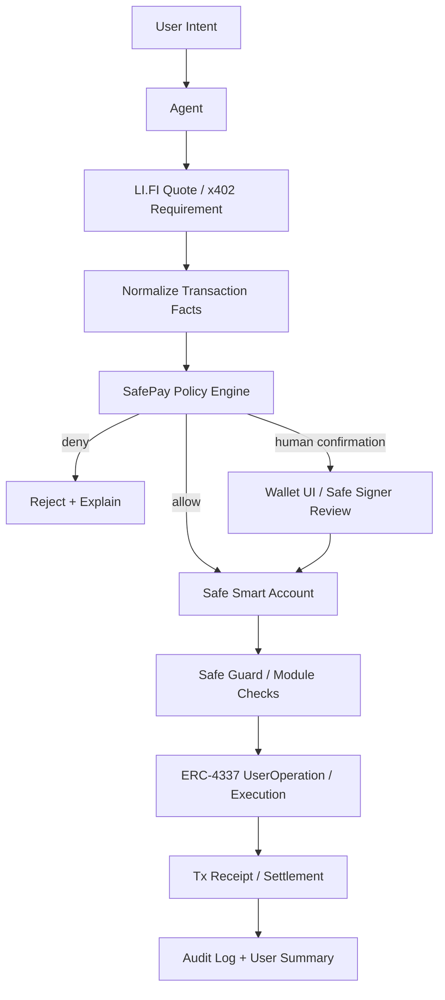

# Week 3 Reading Summary - Safe Wallet 主方向资料摘要

主方向：

```text
Wallet / Permission / Safe Execution
```

项目方向：

```text
SafePay Guard Wallet
```

本次选择 3 个和安全钱包主方向最相关的标准、协议 / SDK / 项目：

1. ERC-4337 Account Abstraction
2. Safe Smart Account + Guards / Modules
3. LI.FI Agent Integration

这三者分别对应：

- ERC-4337：账户如何变成可编程执行环境；
- Safe：钱包如何做多签、模块、guard 和撤销；
- LI.FI：agent 如何拿到真实可执行的跨链交易请求。

## 1. ERC-4337 Account Abstraction

参考资料：

- https://eips.ethereum.org/EIPS/eip-4337

### 它解决什么问题

ERC-4337 解决的是 **账户抽象** 问题：让用户不再只能依赖 EOA 私钥直接发交易，而是可以使用 smart contract account 来定义自己的验证逻辑、签名方式、nonce、gas 支付和批量执行。

对 SafePay Guard Wallet 来说，ERC-4337 的价值是：

- 让 wallet 不只是一个私钥，而是一个可编程账户；
- 用 `UserOperation` 表达用户或 agent 想执行的动作；
- 通过 `EntryPoint`、bundler、paymaster 支撑更灵活的执行；
- 可以把 session key、spending limit、policy、recovery、gas sponsorship 等能力放到账户层；
- agent 发起动作时，可以先生成 UserOperation，再由账户验证是否允许执行。

### 边界是什么

ERC-4337 主要解决的是账户和交易执行基础设施，不直接解决 AI agent 安全。

它不会自动回答：

- 这个 agent 是否可信；
- 这次动作是否符合用户真实意图；
- 这个 recipient 是否安全；
- 这个合约调用是否危险；
- prompt injection 是否发生；
- policy 应该如何设计；
- 高风险动作是否需要人工确认。

ERC-4337 提供的是账户可编程能力，但具体规则要由 smart account、module、guard、policy、wallet product 来实现。

### 还缺什么

对安全钱包项目来说，ERC-4337 还缺：

- 面向 agent 的权限 profile；
- 标准化的 agent session key policy；
- 更直接的 human-in-the-loop 表达方式；
- 针对 tool call / AI action 的风险分级；
- 用户可读的 UserOperation 风险解释；
- 与 x402、LI.FI quote、CAW Pact 等 agent workflow 的上层集成。

### 对 SafePay Guard Wallet 的启发

SafePay Guard Wallet 可以把 agent 的链上动作建模成：

```text
Agent intent -> transaction facts -> policy check -> UserOperation draft -> wallet validation -> execution
```

AI 不直接“签名”，而是负责解释 intent 和生成草稿；ERC-4337 smart account 负责验证和执行。

## 2. Safe Smart Account + Guards / Modules

参考资料：

- Safe Modules: https://docs.safe.global/advanced/smart-account-modules
- Safe Guards: https://docs.safe.global/advanced/smart-account-guards
- `setGuard`: https://docs.safe.global/reference-smart-account/guards/setGuard

### 它解决什么问题

Safe 解决的是 **多人控制、模块化执行和钱包权限分层** 问题。

在 agent wallet 场景里，Safe 的价值非常直接：

- 用户或 DAO 可以作为 Safe owner，保留最终控制权；
- agent 可以通过 module、delegate、session key 或受限 signer 发起动作；
- 多签机制让高风险动作必须多人确认；
- module 可以承载自动化能力；
- guard 可以在交易执行前后检查交易参数；
- owner 可以 remove delegate、disable module、disable guard 或调整阈值。

Safe Guard 特别关键：它可以在交易执行前检查 `to`、`value`、`calldata`、`operation` 等参数，并在不符合规则时阻止执行。

### 边界是什么

Safe 不是 AI 风险引擎。

它本身不会理解：

- 用户自然语言 intent；
- prompt injection；
- 服务方报价是否合理；
- LI.FI route 是否是最佳选择；
- x402 payment requirement 的业务语义；
- 交易是否“对用户有利”。

Safe 更像一个强执行层：只要规则写清楚，它就能执行或阻止。但规则怎么设计、哪些动作是低风险、哪些需要人工确认，需要产品和 policy engine 来定义。

另一个边界是 guard 本身也有风险。Safe 文档明确提醒：guard 有能力阻止 Safe 交易，如果 guard 写坏或恶意，可能造成 denial of service，导致 Safe 里的资金难以操作。因此 guard 需要审计和恢复机制。

### 还缺什么

对 SafePay Guard Wallet 来说，Safe 还缺：

- 面向 AI agent 的标准 policy 模板；
- “自然语言 intent -> transaction facts -> guard checks”的桥接层；
- 面向普通用户的风险解释 UI；
- agent 执行审计日志格式；
- 低风险自动执行 / 高风险人工确认的通用规则库；
- guard 失效或误拦截时的恢复流程设计。

### 对 SafePay Guard Wallet 的启发

SafePay Guard Wallet 应该把 Safe 当成核心执行账户：

```text
User / DAO owner controls Safe
Agent proposes action
Policy / Guard checks action
Safe signs or rejects
Audit log records everything
User can revoke agent
```

这也确认了一个设计原则：

> Agent 不应该拥有 Safe，agent 只能在 Safe owner 授权的边界内提出或执行动作。

## 3. LI.FI Agent Integration

参考资料：

- https://docs.li.fi/agents/overview

### 它解决什么问题

LI.FI Agent Integration 解决的是 **agent 如何调用真实跨链交易工具** 的问题。

LI.FI 提供跨链 swap / bridge / transfer 能力。对 agent 来说，关键能力包括：

- 查询支持的 chains、tokens、tools；
- 获取跨链或 swap 的 quote；
- 从 quote 中拿到可执行的 `transactionRequest`；
- 追踪跨链交易状态；
- 通过 API、SDK、MCP server、CLI 等方式集成。

对 SafePay Guard Wallet 来说，LI.FI 是一个非常真实的高风险工具调用场景：

```text
Agent 可以拿 route 和 transactionRequest，
但 wallet policy 必须决定能不能签名执行。
```

### 边界是什么

LI.FI 主要解决 route / quote / bridge / status，不负责最终钱包安全决策。

它不会替用户决定：

- 是否应该执行这笔交易；
- slippage 是否符合用户风险偏好；
- 目标 token 是否安全；
- 目标 chain 是否在用户授权范围内；
- transactionRequest 是否应该被 agent 自动签名；
- route 失败时是否应该重试；
- 高风险跨链是否需要人工确认。

LI.FI 返回可执行交易数据，但这不等于交易应该被执行。

### 还缺什么

对 SafePay Guard Wallet 来说，LI.FI 还缺：

- agent wallet policy 层；
- route 风险解释；
- quote 与用户 intent 的一致性校验；
- slippage、amount、chain、token、recipient 的策略拦截；
- Safe / ERC-4337 / CAW 的签名前检查；
- 对失败、部分完成、退款等情况的用户可读解释；
- audit log 与长期 reputation / dispute flow。

### 对 SafePay Guard Wallet 的启发

LI.FI 可以成为 Week 3 的真实工具调用扩展：

```text
User intent: bridge 100 USDC from Base to Arbitrum
Agent calls LI.FI quote
LI.FI returns transactionRequest
SafePay normalizes transaction facts
Policy checks chain/token/amount/slippage/recipient
Low risk: prepare execution draft
High risk: ask human confirmation
Wallet signs only after policy passes
```

这能让 SafePay Guard Wallet 从 “x402 API 付款安全” 扩展到 “跨链交易安全执行”。

## 4. 三者如何组合



组合关系：

- LI.FI 提供真实 transactionRequest；
- SafePay Guard Wallet 解释和检查 transaction facts；
- Safe guard / module 提供链上或钱包层拦截；
- ERC-4337 提供可编程账户和执行入口；
- audit log 负责记录每一步。

## 5. 对主方向的判断

这三份资料让我确认：

1. **安全钱包不是一个纯 AI 产品。**  
   因为真正的安全边界必须落在 wallet、smart account、policy、guard、signature、settlement 上。

2. **安全钱包也不是一个纯 Web3 产品。**  
   因为用户需要 AI 帮助理解复杂交易、route、授权、跨链状态和失败后果。

3. **最有价值的位置是执行前的 policy layer。**  
   Agent 可以调用 LI.FI、x402、MCP 工具，但执行前必须经过 SafePay 的结构化检查。

4. **Week 3 应该从 mock payment demo 扩展到真实 transactionRequest 检查。**  
   最小下一步不是马上真签名，而是先接入 LI.FI quote，把 quote 返回的 transactionRequest 转成 policy facts。

## 6. Week 3 下一步

我会把 SafePay Guard Wallet 的 Week 3 MVP 拆成：

1. 接入 LI.FI quote，获取真实 transactionRequest；
2. 把 transactionRequest 解析成 policy facts；
3. 检查 chain、token、amount、recipient、slippage；
4. 输出 `allow / deny / needs human confirmation`；
5. 生成用户可读风险摘要；
6. 暂时不自动签名，只生成 Safe / ERC-4337 execution draft；
7. 把失败和拦截案例写入 attack simulation。

## 7. 简短结论

ERC-4337 让我看到 agent wallet 的账户抽象基础；Safe 让我看到权限分层、guard 和撤销机制；LI.FI 让我看到 agent 调用真实 Web3 工具时会遇到的高风险 transactionRequest。

三者组合后，SafePay Guard Wallet 的定位更清楚了：

> Agent 可以寻找路径和生成动作，但钱包策略决定能不能执行。

