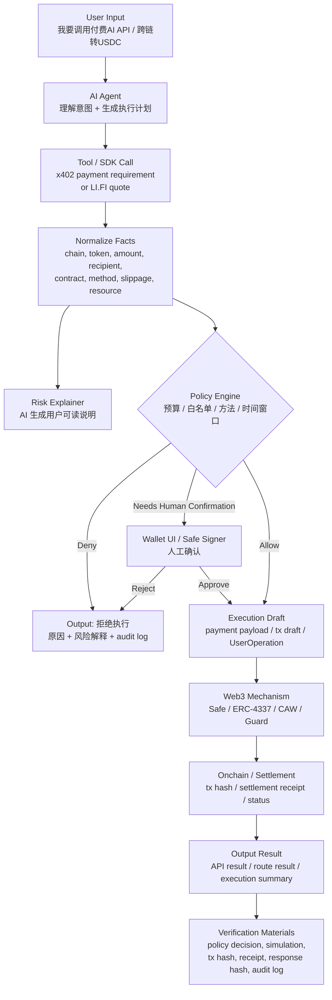

# Week 3 - SafePay Guard Wallet 最小闭环

## 1. 项目一句话

```text
SafePay Guard Wallet = AI Agent 提出链上动作，钱包策略决定是否执行。
```

它不是让 AI 自动控制钱包，而是让 AI 在用户授权的预算、合约、token、chain、recipient 和时间窗口内，辅助发起、解释和验证链上动作。

## 2. 最小闭环图



## 3. 最小场景

### 场景 A：x402 付费 API

用户输入：

```text
帮我调用一个合约审计 API，费用在 0.10 USDC 以内可以自动付款。
```

Agent 处理：

1. 调用 API。
2. 收到 `402 Payment Required`。
3. 解析 payment requirement。
4. 检查 amount、asset、chain、recipient、resource 是否符合 policy。
5. 生成风险解释。
6. 允许时创建 payment payload。
7. 重试 API。
8. 记录 settlement 和 API response hash。

Web3 机制：

- x402 payment requirement；
- CAW / Pact policy；
- USDC payment；
- settlement receipt；
- audit log。

输出结果：

- API 返回的合约审计结果；
- 付款状态；
- settlement tx / demo receipt；
- 本次付款为什么被允许。

验证材料：

- payment requirement hash；
- policy decision；
- payment payload hash；
- settlement receipt；
- response hash；
- audit-log.jsonl。

### 场景 B：LI.FI 跨链 quote

用户输入：

```text
帮我把 100 USDC 从 Base 转到 Arbitrum，滑点不能超过 0.5%。
```

Agent 处理：

1. 调用 LI.FI quote。
2. 获取 `transactionRequest`。
3. 解析 route、chain、token、amount、recipient、contract、method、slippage。
4. 生成用户可读风险摘要。
5. 交给 policy engine 判断。
6. 如果低风险，生成 Safe / ERC-4337 execution draft。
7. 如果高风险，要求人工确认。

Web3 机制：

- LI.FI quote / status；
- Safe smart account；
- ERC-4337 UserOperation；
- guard / policy；
- token allowance / transfer；
- tx receipt。

输出结果：

- quote 摘要；
- allow / deny / needs human confirmation；
- transaction draft；
- 风险解释；
- 验证 checklist。

验证材料：

- LI.FI quote response hash；
- normalized transaction facts；
- simulation result；
- policy decision；
- signer confirmation；
- tx hash；
- route status。

## 4. 模块拆解

| 模块 | 输入 | 处理 | 输出 |
| --- | --- | --- | --- |
| User Intent Parser | 用户自然语言 | 抽取目标、金额、chain、token、限制条件 | structured intent |
| Tool Caller | structured intent | 调 x402 API / LI.FI quote / RPC | payment requirement 或 transactionRequest |
| Fact Normalizer | 工具返回 | 提取 chain、token、recipient、contract、method、amount | policy facts |
| AI Risk Explainer | policy facts + context | 生成用户可读说明 | risk summary |
| Policy Engine | policy facts + policy | 判断 allow / deny / confirm | policy decision |
| Wallet Executor | policy decision + draft | 创建 payment payload / tx draft / UserOperation | execution draft |
| Settlement Tracker | tx / payment result | 追踪状态 | receipt / status |
| Audit Logger | 全流程事件 | 记录 evidence | audit log |

## 5. 自动化边界

### 可自动化

- 解析用户 intent；
- 调用 x402 / LI.FI / RPC；
- 规范化工具返回；
- 生成风险摘要；
- policy check；
- 低金额、白名单、预算内 payment payload；
- 写 audit log；
- 查询 tx status。

### 必须人工确认

- 新 recipient；
- 新合约；
- 新 chain；
- 金额超过单次阈值；
- 今日预算即将耗尽；
- approve / increaseAllowance；
- unlimited approval；
- Safe owner / module / guard 变更；
- simulation 失败；
- route 状态异常；
- policy 变更。

## 6. Policy Facts 示例

```json
{
  "intentId": "intent_001",
  "actionType": "paid_api_call",
  "chain": "base",
  "asset": "USDC",
  "amount": "0.10",
  "recipient": "0xServiceProviderTreasury00000000000000000001",
  "resource": "http://127.0.0.1:4020/v1/infer",
  "contract": "0xBaseUSDC",
  "method": "transfer",
  "requiresApproval": false,
  "simulationStatus": "passed",
  "humanConfirmationRequired": false
}
```

## 7. Policy Decision 示例

```json
{
  "decision": "allow",
  "reason": "within_budget_and_allowlist",
  "checks": {
    "chain": "passed",
    "asset": "passed",
    "amount": "passed",
    "recipient": "passed",
    "resource": "passed",
    "method": "passed",
    "simulation": "passed"
  },
  "auditRequired": true
}
```

## 8. 输出结果格式

```json
{
  "status": "completed",
  "userSummary": "本次调用合约审计 API，费用 0.10 USDC，收款方在白名单内，未涉及 approve，已在预算内完成付款。",
  "policyDecision": "allow",
  "execution": {
    "type": "x402_payment",
    "settlementTx": "demo-settlement-xxx",
    "amount": "0.10",
    "asset": "USDC",
    "network": "base"
  },
  "verification": {
    "requirementHash": "0x...",
    "policyDecisionHash": "0x...",
    "responseHash": "0x...",
    "auditLog": "experiments/x402-caw-agent-payment/audit-log.jsonl"
  }
}
```

## 9. 验证材料清单

最小 demo 必须留下：

- 用户 intent；
- 工具返回原始数据；
- normalized facts；
- policy decision；
- AI risk summary；
- human confirmation 记录，如果有；
- payment payload hash 或 tx draft hash；
- tx hash / settlement receipt；
- API response hash；
- audit log；
- attack simulation report。

## 10. 成功标准

最小闭环成功，不是指 agent 完成最多动作，而是指：

1. 用户输入能被转成结构化 intent；
2. 工具返回能被转成 policy facts；
3. policy 能清楚给出 allow / deny / needs confirmation；
4. 低风险动作能完成；
5. 高风险动作能被拦截或转人工；
6. 每一步都有验证材料；
7. 用户能理解为什么允许、拒绝或要求确认。

## 11. 下一步实现

Week 3 的实现顺序：

1. 在现有 x402 demo 基础上抽出 `normalizeFacts()`；
2. 增加 `evaluatePolicy()` 的更多场景；
3. 加入 LI.FI quote mock 或真实 quote；
4. 输出统一的 `policyDecision`；
5. 生成 `riskSummary`；
6. 把 attack simulation 变成 regression tests；
7. 准备一个前端或 CLI 展示最小闭环。

