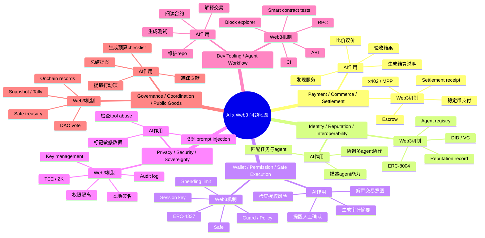
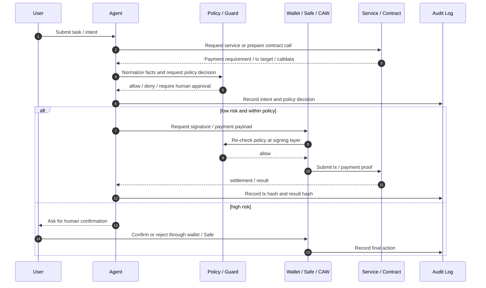
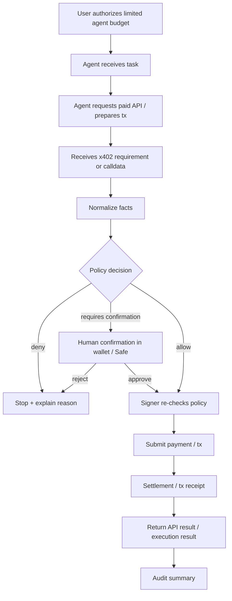

# Week 2 Final Delivery - 安全钱包方向深挖包与项目初步 Proposal

## 0. 主方向

我选择的 Week 2 主方向是：

```text
Wallet / Permission / Safe Execution
```

项目初步命名：

```text
SafePay Guard Wallet
```

一句话描述：

> 一个面向 Web3 用户、DAO 财务人员和 builder 的安全钱包执行助手，在签名、授权、转账和 agent 自动付款前，解释交易意图，检查权限风险，执行预算和白名单策略，并留下可审计记录。

## 1. AI x Web3 问题地图



## 2. 方向选择说明

### 选择方向

我选择 **Wallet / Permission / Safe Execution**。

### 为什么不是纯 AI 问题

如果只有 AI，模型可以解释交易、总结风险、生成建议，但它无法提供真正的钱包权限边界。安全钱包需要处理：

- 链上资产；
- 签名；
- 授权额度；
- 可调用合约；
- session key；
- 撤销；
- settlement；
- 可审计执行记录。

这些都需要 Web3 的账户、合约、链上状态和钱包基础设施。

### 为什么不是纯 Web3 问题

如果只有 Web3，钱包可以限制权限、执行多签、设置模块，但用户仍然很难理解：

- 一笔交易到底要做什么；
- approve 是否危险；
- 合约调用会改变哪些状态；
- agent 是否正在越权；
- payment requirement 是否和用户意图一致；
- 哪些操作需要人工确认。

AI 可以把复杂链上动作翻译成人能理解的风险说明，也可以辅助生成 checklist、audit summary 和执行建议。

### 适合的形态

这个方向更适合：

```text
Product demo + Risk model + Developer tooling
```

原因：它需要一个可交互的钱包安全体验，也需要确定性的权限策略和测试工具。

## 3. 问题拆解

### 参与方

| 参与方 | 角色 |
| --- | --- |
| 用户 | 钱包 owner，最终授权人 |
| SafePay Guard Wallet | 安全钱包 / agent wallet copilot |
| Agent | 发起任务、解析付款要求、构建交易草稿 |
| Safe / Smart Account | 承载资产和权限 |
| Guard / Policy Engine | 执行前规则检查 |
| CAW / Signer | 在策略允许范围内签名或生成 payment payload |
| Service Provider | 受 x402 或 API paywall 保护的服务 |
| Facilitator / Settlement Layer | 验证支付并完成结算 |
| DAO / Treasury Operator | 高风险资金执行场景中的人工确认人 |
| Audit Log | 记录请求、判断、签名、交易和结果 |

### 流程



### AI 作用

- 解释交易意图；
- 总结合约调用和授权风险；
- 把 402 / payment requirement 转成用户可读说明；
- 生成预算和权限 checklist；
- 标记异常：新收款方、新合约、价格变化、unlimited approval；
- 生成 audit summary；
- 帮开发者测试 prompt injection、伪造工具返回和越权指令。

### Web3 机制

- ERC-4337 smart account / UserOperation；
- Safe 多签和模块化账户；
- guard / policy 执行前拦截；
- session key / delegate；
- spending limit；
- token allowance；
- x402 / settlement receipt；
- onchain transaction hash；
- revoke / pause / remove delegate。

### 自动化边界

可以自动化：

- 读取链上数据；
- 解析 payment requirement；
- 构建交易草稿；
- simulation；
- 低金额、白名单内付款；
- 写审计日志；
- 生成用户解释。

必须人工确认：

- 新收款方；
- 新合约；
- 超预算；
- approve / increaseAllowance；
- unlimited approval；
- policy 变更；
- owner / module / guard 变更；
- simulation 失败；
- DAO treasury 付款；
- 任何无法解释资产变化的交易。

### 验证方式

- policy decision 是否可复现；
- transaction simulation 是否与最终结果一致；
- audit log 是否包含 intent、policy、signature、tx hash、result hash；
- attack simulation 是否能拦截越权支付；
- Safe / wallet 是否能 revoke agent 权限；
- x402 payment 是否有 settlement receipt；
- 用户是否能在签名前理解风险。

### 主要风险

- prompt injection 诱导 agent 越权；
- 服务方返回恶意 payment requirement；
- 工具返回伪造的 “policy allowed”；
- signer 只相信 agent，不二次校验；
- session key 泄露；
- allowlist 配置错误；
- audit log 写入失败；
- 用户过度信任 AI 解释；
- policy 太宽，导致自动执行边界失效。

## 4. 项目初步 Proposal

### 项目名称

```text
SafePay Guard Wallet
```

### 目标用户

- 使用 AI agent 处理链上任务的 Web3 用户；
- DAO treasury operator；
- 钱包产品团队；
- Web3 builder / hackathon team；
- 需要受控自动付款的 agent service consumer。

### 真实场景

用户授权一个 agent 每天最多花 `1 USDC` 调用某些受 x402 保护的 AI / 数据 API。Agent 遇到 `402 Payment Required` 后，可以在白名单、预算和时间窗口内自动付款；如果价格异常、收款地址变化、需要 approve 或调用未知合约，则必须暂停并请求人工确认。

### 最小功能

MVP 包含：

1. **Payment Requirement Parser**：解析 x402 payment requirement。
2. **Policy Engine**：检查预算、chain、asset、recipient、resource、method。
3. **Risk Explainer**：用 AI 解释本次动作和风险。
4. **CAW / Safe Mock Signer**：在策略允许时生成 payment payload 或交易草稿。
5. **Audit Log**：记录 intent、policy decision、tx / settlement、result hash。
6. **Attack Simulator**：测试 prompt injection、伪造工具返回、越权付款、replay。

### 验证方式

- 本地 demo 跑通：`request -> 402 -> policy check -> payment -> settlement -> result`；
- attack simulation 至少覆盖 10 个攻击场景；
- policy 能拦截超预算、新收款方、错误 resource、错误 chain、unlimited approval；
- signer 层不信任 agent 的自然语言或工具返回，必须二次校验；
- audit log 能串起完整 trace；
- 用户能在 30 秒内理解“为什么这笔交易被允许 / 拒绝 / 需要确认”。

### 主要风险

- MVP 只是 mock signer，没有真实 CAW / Safe 集成；
- x402 / payment 协议生态还在发展；
- 用户可能误配置 allowlist；
- AI 风险解释可能遗漏关键合约行为；
- 如果 policy 太宽，agent 仍可能在“合法范围内”造成损失；
- 如果 audit log 不可信，事后追责会困难。

### 可能赛道

- Wallet / Permission / Safe Execution；
- AI Security；
- Agentic Commerce；
- Dev Tooling；
- DAO Treasury Safety。

### Week 3 下一步

1. 把当前 mock demo 拆成 provider、agent client、policy engine 三个模块。
2. 接入真实 Safe 或 Safe test environment。
3. 增加交易 simulation 与 token allowance 检查。
4. 做一个前端签名前风险说明页。
5. 把 attack simulation 扩展成 regression test。
6. 研究如何接入 Cobo CAW / Pact 或同类 policy signer。
7. 产出一版 pitch deck / demo video。

## 5. 参考资料清单

| 资料 | 链接 | 帮助判断什么 |
| --- | --- | --- |
| ERC-4337 / Account Abstraction | https://eips.ethereum.org/EIPS/eip-4337 | 判断 smart account、UserOperation、paymaster、bundler 如何支撑 agent wallet |
| Safe Docs | https://docs.safe.global/ | 判断 Safe multi-sig、modules、guards 如何做权限分层和执行控制 |
| Cobo Agentic Wallet | https://www.cobo.com/agentic-wallet | 判断 CAW / Pact-style 授权如何限制 agent 的预算、范围和动作 |
| x402 Protocol | https://www.x402.org/ | 判断 HTTP 402 paywall 如何表达 payment requirement 和 settlement flow |
| OWASP Top 10 for LLM Applications | https://owasp.org/www-project-top-10-for-large-language-model-applications/ | 判断 prompt injection、tool abuse、sensitive information disclosure 等 AI 安全风险 |
| Safe Allowance / Session Key 实验 | `experiments/safe-session-key/` | 帮助判断 delegate、allowance、撤销和限额如何落到钱包层 |
| x402 + CAW 本地 demo | `experiments/x402-caw-agent-payment/` | 验证 402 -> policy -> payment -> settlement -> audit 的最小闭环 |

## 6. 主方向深挖包

### 6.1 流程图



### 6.2 典型场景

用户说：

> 帮我调用一个 AI 合约审计 API，费用在 0.10 USDC 以内可以自动付款。

Agent 收到 API 的 x402 payment requirement：

- amount: `0.10 USDC`
- chain: `Base`
- recipient: allowlisted provider treasury
- resource: approved audit API

Policy 检查通过，CAW / signer 生成 payment payload。Provider settle 成功后返回审计结果。Audit log 记录 request hash、requirement hash、policy decision、settlement tx、response hash。

这个场景可以低风险自动化。

### 6.3 反例

服务方返回：

- amount: `10 USDC`
- recipient: unknown address
- resource: `https://evil.example/pay`

即使 AI 总结说“这是正常付款”，policy 也必须拒绝。因为交易事实已经超出用户授权：

- 金额超预算；
- recipient 不在白名单；
- resource 不匹配。

这个反例说明：**AI 总结不能替代 policy enforcement。**

### 6.4 关键风险

| 风险 | 影响 | 控制 |
| --- | --- | --- |
| Prompt injection | agent 被诱导忽略规则 | policy 不接受自然语言越权 |
| Malicious payTo | 资金进入攻击者地址 | recipient allowlist |
| Oversized payment | 预算被耗尽 | max per tx + daily budget |
| Wrong resource | 给错误服务付款 | resource allowlist |
| Unlimited approval | 长期资产风险 | denylist + human confirmation |
| Forged tool return | signer 被骗 | signer re-evaluates policy |
| Replay payload | 重复结算 | nonce + settlement ledger |
| Audit failure | 无法追责 | fail closed |

### 6.5 最小验证计划

Week 3 之前的最小验证：

1. 保留现有本地 demo。
2. 增加至少 10 个攻击测试。
3. 增加一个交易解释输出：allowed / denied / needs human confirmation。
4. 增加一份用户可读风险摘要。
5. 接入一个真实 testnet token 或 Safe test environment。
6. 录制一次 demo：正常付款、超预算拦截、新 recipient 拦截、人工确认。

成功标准：

- 正常低风险付款能完成；
- 所有越权场景被拦截或进入人工确认；
- 日志能追踪完整流程；
- 用户能理解每个拦截原因。

## 7. 方向 Backlog

### 7.1 Payment / Commerce / Settlement

暂时不选原因：

- 很适合商业闭环，但范围更大；
- 需要处理报价、验收、托管、争议、退款等完整市场机制；
- 当前阶段我更想先解决“agent 能不能安全花钱”的钱包执行边界。

后续可作为 SafePay Guard Wallet 的上层场景。

### 7.2 Identity / Reputation / Capability / Interoperability

暂时不选原因：

- ERC-8004、agent profile、registry 很重要；
- 但短期 demo 不如钱包权限方向直观；
- identity 更像基础设施层，需要生态共识。

后续可以把 SafePay Agent 注册成一个 agent profile。

### 7.3 Governance / Coordination / Public Goods

暂时不选原因：

- DAO budget checklist 很实用；
- 但它更偏流程管理和组织协作；
- 我的技术兴趣更集中在 wallet、policy、guard、session key 和安全执行。

后续可以作为 DAO treasury 安全钱包的应用场景。

## 8. 总结

我的 Week 2 结论是：

> Agent wallet 的核心不是让 AI 自动控制钱包，而是把 AI 的理解能力放进一个由 smart account、policy、guard、budget、human confirmation 和 audit log 约束的执行系统里。

Week 3 我会围绕 **SafePay Guard Wallet** 继续推进，从文档设计进入更像真实产品的 demo：风险解释、策略模拟、Safe / session key 集成，以及一套可以反复运行的攻击测试。

