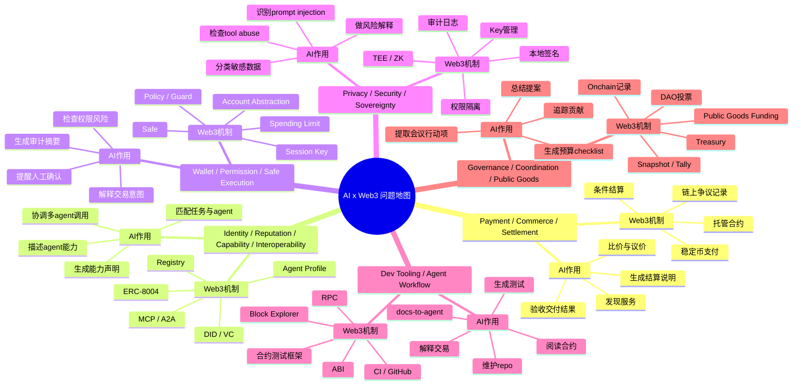

# Week 2 Module A - AI x Web3 问题地图

## 1. AI x Web3 问题地图

## 2. 方向说明

| 方向 | AI 的作用 | Web3 机制 |
| --- | --- | --- |
| Payment / Commerce / Settlement | 帮 agent 发现服务、比较报价、判断交付是否合格、生成结算说明 | 稳定币、托管合约、条件支付、争议记录、链上结算 |
| Identity / Reputation / Capability / Interoperability | 描述 agent 是谁、能做什么、可信度如何，并帮助不同 agent 协作 | registry、agent profile、DID/VC、ERC-8004、MCP/A2A |
| Wallet / Permission / Safe Execution | 在签名、授权、转账前做风险解释、权限检查和人工确认提示 | Account Abstraction、Safe、policy、guard、session key、spending limit |
| Privacy / Security / Sovereignty | 识别 prompt injection、工具滥用、敏感数据暴露和供应商依赖风险 | 本地签名、权限隔离、TEE/ZK、审计日志、密钥管理 |
| Dev Tooling / Agent Workflow | 帮 builder 读合约、解释交易、生成测试、维护文档和 repo | ABI、RPC、区块浏览器、CI、GitHub、合约测试框架 |
| Governance / Coordination / Public Goods | 总结提案、整理会议行动项、追踪贡献、辅助预算透明执行 | DAO 投票、Treasury、Snapshot/Tally、链上记录、公共物品资助 |

一句话总结：AI 负责理解、规划、解释和协调；Web3 负责身份、权限、支付、记录和可验证执行。

## 3. 从地图中选择 2 个方向

### 方向一：Wallet / Permission / Safe Execution

真实用户是希望让 AI Agent 帮忙处理链上任务，但又担心误签、过度授权、权限滥用和资产损失的 Web3 用户、DAO 财务人员、链上交易员和钱包产品用户。

它不是纯 AI 问题：如果只有 AI，模型可以解释交易和提示风险，但无法处理真实的钱包、签名、链上资产、授权撤销和可审计执行记录。没有 Web3，这个问题只会变成普通软件权限管理。

它也不是纯 Web3 问题：如果只有 Web3，用户仍然需要自己理解复杂合约调用、授权额度、签名含义、资产变化和潜在风险。没有 AI，安全执行的理解成本和操作门槛仍然很高。

更适合的形态：product demo + risk model。

### 方向二：Dev Tooling / Agent Workflow

真实用户是 Web3 builder，包括合约开发者、协议工程师、黑客松团队、技术写作者和开源仓库维护者。

它不是纯 AI 问题：如果只有 AI，工具无法真正理解 ABI、RPC、交易、合约状态、测试框架和链上执行环境，也无法和真实开发流程闭环。

它也不是纯 Web3 问题：如果只有 Web3，builder 仍然需要手动阅读合约、解释交易、生成测试、维护文档和整理 repo，效率低且容易遗漏上下文。

更适合的形态：developer tooling + product demo。

## 4. Week 2 主线选择

我选择 **Wallet / Permission / Safe Execution** 作为 Week 2 主线。

原因：我的 Web3 基础相对更好，而这个方向最需要理解钱包、签名、授权、合约调用、账户抽象、Safe、session key、policy、guard、撤销和 simulation。AI 在这里不是单纯生成内容，而是帮助用户把复杂链上动作解释清楚、把权限风险拎出来、把执行边界守住。

后续拆解和 proposal 可以围绕这个主线继续推进：

> AI Wallet Safe Execution Copilot：一个面向 Web3 用户、DAO 财务人员和 builder 的 AI 钱包安全执行助手。在用户签名、授权、转账或合约调用前，解释交易意图，检查权限风险，提示人工确认，并生成可审计记录。

