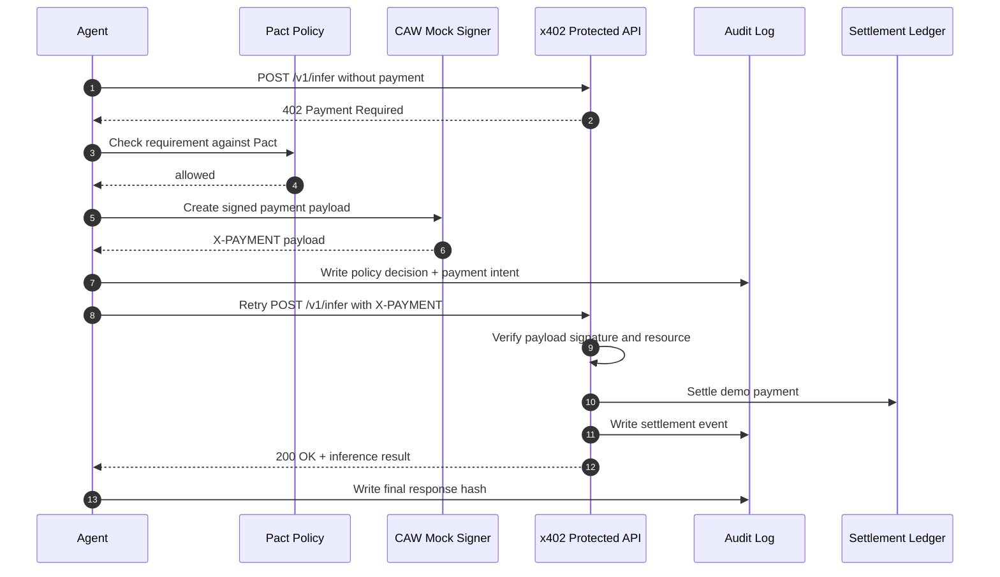

# Week 2 Module B - x402 + Cobo CAW Agent Payment Real Demo

## Demo Path

Executable demo:

```text
experiments/x402-caw-agent-payment/
```

Run:

```bash
node experiments/x402-caw-agent-payment/src/demo.js
```

## What Was Built

This is a local runnable demo of a minimal x402 paywall + CAW/Pact-style agent payment loop.

The demo includes:

- An x402-protected provider API: `POST /v1/infer`
- A consumer agent that first calls the API without payment
- A `402 Payment Required` response with x402-style payment requirements
- A Pact policy check for budget, API scope, recipient, chain, asset, and time window
- A CAW-style mock signer that creates a signed payment payload
- A provider-side verification and settlement step
- A local settlement ledger
- A JSONL audit log for the whole flow
- A final paid API response returned to the agent

## Flow



## Pact Policy

The demo policy is stored in:

```text
experiments/x402-caw-agent-payment/pact-policy.json
```

It limits:

- Chain: `base`
- Asset: `USDC`
- API resource: `http://127.0.0.1:4020/v1/infer`
- Recipient: `0xServiceProviderTreasury00000000000000000001`
- Max payment: `0.10 USDC`
- Daily budget: `1.00 USDC`
- Max payments per day: `10`
- Time window: from `2026-05-28` until demo expiry

## Verified Run Output

The demo was run successfully on 2026-05-28. The final agent response included:

```json
{
  "summary": "Demo inference result: the agent paid within a Pact budget and can now access the protected API result.",
  "recommendation": "Keep x402 payment automation behind allowlists, amount caps, time windows, and audit logs.",
  "payment": {
    "status": "settled",
    "settlementTx": "demo-settlement-5dddaa695e7c6c86",
    "amount": "0.10",
    "asset": "USDC",
    "network": "base"
  }
}
```

Generated audit files:

```text
experiments/x402-caw-agent-payment/audit-log.jsonl
experiments/x402-caw-agent-payment/settlement-ledger.json
```

## Audit Trail Events

The generated audit log records:

- `agent_started_request`
- `provider_returned_402`
- `agent_received_402`
- `pact_policy_decision`
- `caw_payment_payload_created`
- `provider_payment_settled`
- `provider_returned_paid_result`
- `agent_completed_paid_request`

## Risk Boundary

This demo intentionally uses mocked CAW signing and local settlement. It does not move real funds.

The real production boundary should be:

- Pact enforcement must happen at the wallet/signing layer, not only inside the agent.
- New recipients, larger budgets, unknown APIs, unknown chains, and policy changes require human approval.
- No private key, API key, session key, or raw secret may enter the audit log.
- Payment replay must be prevented with nonces.
- The x402 payment requirement resource must match the API being called.
- The provider must verify payment and settle before returning the protected result.

## Conclusion

The demo proves the core loop:

```text
request -> 402 -> Pact check -> CAW payment payload -> retry -> verify/settle -> audit -> result
```

The important design point is not blind automation. The useful pattern is bounded automation: the agent can pay only inside a pre-authorized policy envelope, and every step leaves an auditable trace.

