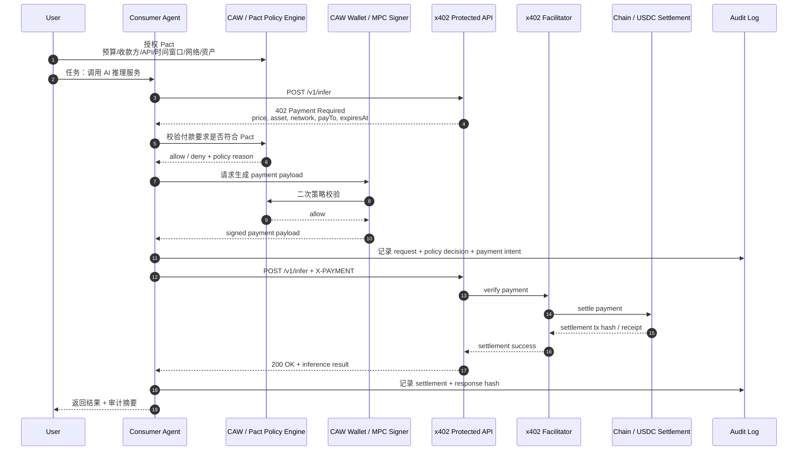

# Week 2 Module B - x402 Paywall + Cobo CAW Agent 自主支付闭环设计

## 0. 任务目标

本方案尝试设计一个最小化的 **x402 paywall + Cobo CAW agent 自主支付闭环**。

目标不是让 agent 无限制自动付款，而是在明确授权、预算控制、操作范围限制和可审计记录下，完成一次从服务请求、识别付款要求、受控支付、payment settlement 到获取接口结果的闭环。

参考资料：

- x402 protocol: https://www.x402.org/
- Cobo Agentic Wallet: https://www.cobo.com/agentic-wallet
- Cobo x402 payment recipe: https://www.cobo.com/agentic-wallet/recipes/x402-payment

## 1. 场景设定

### 服务提供方

服务提供方提供一个受 x402 保护的 AI 推理 API：

```text
POST /v1/infer
```

服务内容：

- 输入：一段 prompt 或任务描述
- 输出：AI 推理结果
- 价格：0.10 USDC / request
- 支付网络：Base
- 结算资产：USDC

### 消费方

消费方不是用户手动打开网页付款，而是由一个 agent 发起请求。agent 需要：

1. 请求受保护 API。
2. 识别 HTTP 402 付款要求。
3. 检查 CAW / Pact 授权策略。
4. 在预算、时间窗口、资产、网络和收款方都符合策略时完成支付。
5. 将 payment payload 附加到请求中重试。
6. 在服务端 settle 成功后获取 API 结果。
7. 记录完整审计日志。

## 2. 系统架构图



## 3. Pact 授权策略

Pact 是整个设计的安全边界。agent 不能因为看到 402 就直接付款，而是必须在 Pact 允许的范围内执行。

### 最小策略示例

```json
{
  "name": "week2-x402-ai-inference-budget",
  "subject": "agent:learning-copilot",
  "valid_from": "2026-05-28T00:00:00+08:00",
  "valid_until": "2026-05-29T00:00:00+08:00",
  "chain_allowlist": ["base"],
  "asset_allowlist": ["USDC"],
  "recipient_allowlist": [
    "0xServiceProviderTreasury"
  ],
  "api_allowlist": [
    "https://api.example.ai/v1/infer"
  ],
  "max_amount_per_payment": "0.10",
  "daily_budget": "1.00",
  "max_payments_per_day": 10,
  "require_human_approval_above": "0.10",
  "forbidden_actions": [
    "approve_unlimited",
    "transfer_native_token",
    "call_unknown_contract",
    "change_policy",
    "withdraw_all"
  ],
  "audit_required": true
}
```

### 策略解释

| 约束 | 作用 |
| --- | --- |
| `valid_until` | 限制 agent 的自动支付时间窗口 |
| `chain_allowlist` | 防止 agent 在错误链或钓鱼链付款 |
| `asset_allowlist` | 限制只能使用指定结算资产 |
| `recipient_allowlist` | 防止 402 返回恶意收款地址 |
| `api_allowlist` | 防止 agent 把预算花到未授权服务 |
| `max_amount_per_payment` | 限制单次付款 |
| `daily_budget` | 限制总预算 |
| `require_human_approval_above` | 超出阈值必须人工确认 |
| `audit_required` | 每次决策和付款必须留痕 |

## 4. x402 交互流程

### 第一次请求

Agent 调用受保护 API：

```http
POST /v1/infer HTTP/1.1
Host: api.example.ai
Content-Type: application/json

{
  "prompt": "Summarize this contract interaction risk."
}
```

服务端没有收到有效付款，返回 `402 Payment Required`：

```http
HTTP/1.1 402 Payment Required
Content-Type: application/json

{
  "x402Version": 1,
  "accepts": [
    {
      "scheme": "exact",
      "network": "base",
      "asset": "USDC",
      "amount": "0.10",
      "payTo": "0xServiceProviderTreasury",
      "resource": "https://api.example.ai/v1/infer",
      "expiresAt": "2026-05-28T23:59:59+08:00"
    }
  ],
  "error": "payment_required"
}
```

### Agent 策略校验

Agent 不直接付款，而是把付款要求交给 Pact：

```typescript
type PaymentRequirement = {
  scheme: "exact";
  network: "base";
  asset: "USDC";
  amount: string;
  payTo: string;
  resource: string;
  expiresAt: string;
};

async function checkPact(requirement: PaymentRequirement, pact: Pact) {
  assert(pact.chain_allowlist.includes(requirement.network));
  assert(pact.asset_allowlist.includes(requirement.asset));
  assert(pact.recipient_allowlist.includes(requirement.payTo));
  assert(pact.api_allowlist.includes(requirement.resource));
  assert(Number(requirement.amount) <= Number(pact.max_amount_per_payment));
  assert(await getSpentToday(pact.subject) + Number(requirement.amount) <= Number(pact.daily_budget));
  assert(new Date() < new Date(pact.valid_until));
  return { allowed: true };
}
```

### 付款并重试

策略通过后，CAW 生成 payment payload。Agent 使用该 payload 重试请求：

```http
POST /v1/infer HTTP/1.1
Host: api.example.ai
Content-Type: application/json
X-PAYMENT: <signed-x402-payment-payload>

{
  "prompt": "Summarize this contract interaction risk."
}
```

服务端通过 x402 facilitator 验证并 settle payment。成功后返回：

```http
HTTP/1.1 200 OK
Content-Type: application/json

{
  "result": "This transaction appears to grant limited USDC spending permission...",
  "payment": {
    "status": "settled",
    "settlementTx": "0xSettlementTxHash",
    "amount": "0.10",
    "asset": "USDC",
    "network": "base"
  }
}
```

## 5. 最小伪代码

```typescript
async function callPaidInference(prompt: string) {
  const request = {
    method: "POST",
    url: "https://api.example.ai/v1/infer",
    body: { prompt }
  };

  const firstResponse = await http(request);

  if (firstResponse.status !== 402) {
    return firstResponse.body;
  }

  const requirement = parseX402PaymentRequirement(firstResponse.body);

  const decision = await pactEngine.evaluate({
    agentId: "agent:learning-copilot",
    action: "x402_payment",
    requirement
  });

  await auditLog.write({
    event: "payment_requirement_received",
    requirement,
    decision
  });

  if (!decision.allowed) {
    throw new Error(`Payment denied by Pact: ${decision.reason}`);
  }

  const paymentPayload = await caw.signX402Payment({
    requirement,
    pactId: decision.pactId
  });

  await auditLog.write({
    event: "payment_payload_created",
    requirementHash: hash(requirement),
    pactId: decision.pactId
  });

  const paidResponse = await http({
    ...request,
    headers: {
      "X-PAYMENT": paymentPayload
    }
  });

  await auditLog.write({
    event: "paid_request_completed",
    status: paidResponse.status,
    settlementTx: paidResponse.body.payment?.settlementTx,
    responseHash: hash(paidResponse.body)
  });

  return paidResponse.body;
}
```

## 6. 关键接口说明

### 服务提供方接口

| 接口 | 说明 |
| --- | --- |
| `POST /v1/infer` | 受 x402 保护的 AI 推理服务 |
| `402 Payment Required` | 返回价格、资产、网络、收款方、资源和过期时间 |
| `X-PAYMENT` | Agent 重试时携带的 x402 payment payload |
| `200 OK` | payment settlement 成功后返回推理结果 |

### 消费方 Agent 接口

| 模块 | 职责 |
| --- | --- |
| `x402Client` | 识别 402、解析付款要求、重试请求 |
| `pactEngine` | 检查预算、时间、资产、链、收款方和 API scope |
| `cawSigner` | 在 Pact 允许范围内生成 payment payload |
| `auditLog` | 记录每一次请求、策略判断、付款和结果 |

### 审计日志字段

```json
{
  "timestamp": "2026-05-28T12:00:00+08:00",
  "agent_id": "agent:learning-copilot",
  "user_id": "user:tz-hao",
  "api": "https://api.example.ai/v1/infer",
  "payment_requirement_hash": "0x...",
  "pact_id": "pact_week2_x402_ai_inference_budget",
  "decision": "allowed",
  "amount": "0.10",
  "asset": "USDC",
  "network": "base",
  "recipient": "0xServiceProviderTreasury",
  "settlement_tx": "0xSettlementTxHash",
  "response_hash": "0x..."
}
```

## 7. 风险边界

### 必须禁止

- Agent 自行扩大预算。
- Agent 修改 Pact。
- Agent 付款给未授权收款方。
- Agent 在未授权链上付款。
- Agent 执行 unlimited approval。
- Agent 在没有审计日志的情况下付款。
- Agent 把私钥、API key、session key 写入日志或提交到仓库。

### 必须人工确认

- 单次金额超过阈值。
- 今日预算即将耗尽。
- 收款方不在 allowlist。
- 服务价格变化超过预期。
- API 返回的资源和 402 payment requirement 中的 resource 不一致。
- 需要 approve、delegate、upgrade、change owner 等高风险操作。

### 最小可接受自动化

Agent 可以自动完成以下动作：

- 识别 402。
- 解析付款要求。
- 查询 Pact。
- 在严格 allowlist 和预算内生成 payment payload。
- 重试 API 请求。
- 记录 settlement 和 response hash。

但 agent 不应该自动完成：

- 新增收款方。
- 提高预算。
- 修改策略。
- 对未知合约授权。
- 对高风险操作签名。

## 8. 最小 Demo 交付物

如果做真实 demo，可以拆成 4 个最小组件：

1. `provider`: 一个受 x402 保护的 mock AI API。
2. `agent-client`: 一个能处理 402 并重试的 agent 客户端。
3. `pact-policy.json`: CAW / Pact 授权策略。
4. `audit-log.jsonl`: 每次请求、付款、结算和结果的审计记录。

目录草案：

```text
experiments/x402-caw-agent-payment/
  provider/
    server.ts
  agent-client/
    client.ts
  pact-policy.json
  audit-log.jsonl
  README.md
```

## 9. 结论

这个设计的重点不是“让 agent 自动花钱”，而是让 agent 在用户明确授权的 Pact 边界内完成可审计的机器支付。

在这个闭环里：

- x402 负责把 API 访问和付款要求标准化。
- CAW / Pact 负责限制 agent 的预算、范围、时间窗口和动作权限。
- Agent 负责理解 402、协调支付、重试请求和整理结果。
- Audit log 负责让每一次自动交易可追溯、可解释、可复盘。

这正好对应 Week 2 主线 **Wallet / Permission / Safe Execution**：AI 可以协助执行，但执行权必须被 Web3 权限系统和审计机制约束。

