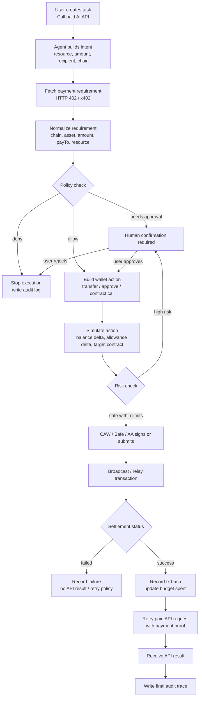
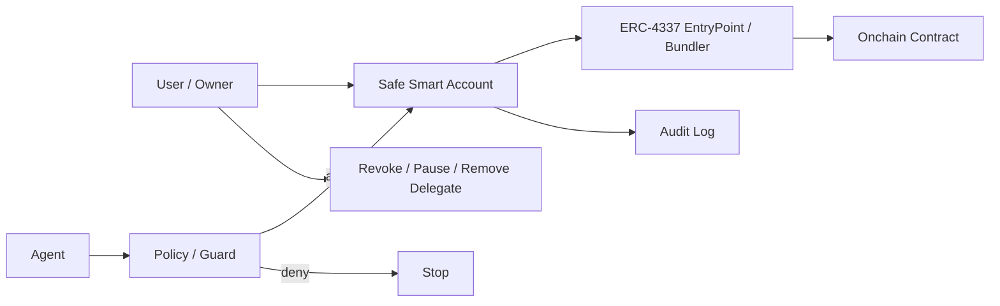

# Week 2 Module D - Agent Wallet 执行流程与权限策略

## 1. 场景选择

我继续沿用 Week 2 的主线：**Wallet / Permission / Safe Execution**。

具体场景：

> SafePay Execution Agent 代表用户调用一个受 x402 保护的 AI API。API 需要 0.10 USDC 付款。Agent 需要发起链上支付或链上授权相关动作，但只能在用户预先授权的预算、合约、动作和时间窗口内执行。

这个场景的重点不是“agent 能不能自动转账”，而是：**agent 如何在可控权限内发起链上动作，并在关键风险点交还给人确认。**

## 2. Agent 发起链上动作的执行流程图



## 3. 自动化与人工确认边界

| 步骤 | 是否可自动化 | 原因 |
| --- | --- | --- |
| 解析用户任务 | 可以自动化 | 只是理解 intent，不产生链上后果 |
| 获取 x402 payment requirement | 可以自动化 | 读取服务方报价和付款要求 |
| 规范化 chain / asset / amount / recipient | 可以自动化 | 数据清洗和格式检查 |
| Pact / policy 初步校验 | 可以自动化 | 用确定性规则判断是否在授权范围内 |
| 查询余额、allowance、合约信息 | 可以自动化 | 只读链上数据 |
| 构建交易草稿 | 可以自动化 | 只构建，不执行 |
| simulation | 可以自动化 | 验证预期资产变化和调用结果 |
| 低金额、allowlist 内付款 | 可以自动化 | 已被预算、收款方、资源和时间窗口约束 |
| 超预算付款 | 必须人工确认 | 已超出用户授权 |
| 新收款方 | 必须人工确认 | 可能是 phishing 或服务方被替换 |
| 新合约调用 | 必须人工确认 | 合约行为未知 |
| approve / increaseAllowance | 通常必须人工确认 | 授权可能带来持续风险 |
| unlimited approval | 必须禁止或强人工确认 | 风险过高 |
| policy 变更 | 必须人工确认 | agent 不能自己扩大权限 |
| revoke / pause agent | 可以由用户一键执行 | 这是 kill switch，不应依赖 agent 同意 |

## 4. Agent Wallet 权限策略

### 4.1 策略目标

这个策略用于限制 SafePay Execution Agent 的链上动作：

- 只允许在 Base 上支付 USDC；
- 只允许调用指定 x402 服务和指定收款地址；
- 控制单次预算、每日预算和有效期；
- 高风险动作必须人工确认；
- 所有动作必须记录日志；
- 失败时默认 fail closed。

### 4.2 Policy 草图

```json
{
  "policyId": "policy_safepay_week2_module_d",
  "agentId": "agent:safepay-execution:v0.1",
  "wallet": {
    "type": "Safe",
    "chain": "base",
    "safeAddress": "0xUserSafe",
    "agentDelegate": "0xAgentDelegate"
  },
  "validity": {
    "validFrom": "2026-05-28T00:00:00+08:00",
    "validUntil": "2026-06-04T00:00:00+08:00"
  },
  "budget": {
    "asset": "USDC",
    "maxPerTransaction": "0.10",
    "dailyLimit": "1.00",
    "weeklyLimit": "5.00",
    "maxTransactionsPerDay": 10
  },
  "allowedContracts": [
    {
      "name": "USDC",
      "address": "0xBaseUSDC",
      "allowedMethods": ["transfer"]
    },
    {
      "name": "x402SettlementEscrow",
      "address": "0xX402SettlementEscrow",
      "allowedMethods": ["settlePayment"]
    }
  ],
  "allowedRecipients": [
    "0xServiceProviderTreasury00000000000000000001"
  ],
  "allowedResources": [
    "https://api.example.ai/v1/infer"
  ],
  "allowedActions": [
    "read_payment_requirement",
    "simulate_transaction",
    "transfer_usdc_to_allowlisted_recipient",
    "settle_x402_payment",
    "write_audit_log"
  ],
  "forbiddenActions": [
    "approve_unlimited",
    "upgrade_contract",
    "change_safe_owner",
    "change_policy",
    "add_new_recipient",
    "transfer_native_token",
    "call_unknown_contract",
    "delegatecall"
  ],
  "humanConfirmation": {
    "requiredAboveAmount": "0.10",
    "requiredForNewRecipient": true,
    "requiredForNewContract": true,
    "requiredForApprove": true,
    "requiredForPolicyChange": true,
    "requiredForFailedSimulation": true
  },
  "revocation": {
    "methods": [
      "remove Safe delegate",
      "disable session key",
      "pause policy",
      "set dailyLimit to 0",
      "revoke token allowance"
    ],
    "whoCanRevoke": ["Safe owner", "guardian", "policy admin"],
    "agentConsentRequired": false
  },
  "logging": {
    "required": true,
    "events": [
      "intent_created",
      "payment_requirement_received",
      "policy_decision",
      "simulation_result",
      "human_confirmation",
      "transaction_submitted",
      "transaction_settled",
      "api_result_received",
      "failure"
    ],
    "fields": [
      "timestamp",
      "agentId",
      "policyId",
      "safeAddress",
      "chain",
      "targetContract",
      "method",
      "amount",
      "asset",
      "recipient",
      "resource",
      "txHash",
      "simulationHash",
      "decision",
      "reason"
    ]
  },
  "failureHandling": {
    "defaultMode": "fail_closed",
    "onPolicyDeny": "stop_and_log",
    "onSimulationFailure": "require_human_confirmation",
    "onTxFailure": "record_failure_and_do_not_retry_without_policy_check",
    "onSettlementFailure": "do_not_return_paid_api_result",
    "onAuditFailure": "stop_execution",
    "onBudgetExceeded": "stop_and_request_new_user_authorization"
  }
}
```

## 5. 关键策略解释

### 预算

预算不是建议，而是硬约束。Agent 不应该“自觉省钱”，而是必须被钱包、policy 或 module 限制：

- 单次最多 0.10 USDC；
- 每日最多 1.00 USDC；
- 每周最多 5.00 USDC；
- 每日最多 10 次付款。

### 可调用合约

只允许调用：

- USDC 合约的 `transfer`；
- x402 settlement escrow 的 `settlePayment`。

所有未知合约调用默认拒绝。

### 可执行动作

允许：

- 读取付款要求；
- simulation；
- 向白名单收款方转 USDC；
- settlement；
- 写审计日志。

禁止：

- unlimited approval；
- 修改 Safe owner；
- 修改 policy；
- 添加新 recipient；
- transfer native token；
- delegatecall；
- 调用未知合约。

### 人工确认阈值

以下情况必须人工确认：

- 单次金额大于 0.10 USDC；
- 收款方不在白名单；
- 合约不在白名单；
- 需要 approve；
- simulation 失败或无法解释资产变化；
- policy 变更；
- 服务价格突然变化。

### 撤销方式

撤销必须不依赖 agent 同意。用户或 guardian 应该能：

- remove Safe delegate；
- disable session key；
- pause policy；
- set daily limit to 0；
- revoke token allowance；
- rotate signer；
- remove module / guard。

### 日志记录

日志是 agent wallet 的“黑匣子”。至少记录：

- 谁发起了 intent；
- policy 如何判断；
- simulation 结果；
- 谁确认了高风险动作；
- 交易 hash；
- settlement receipt；
- API response hash；
- 失败原因。

### 失败处理

默认策略必须是 **fail closed**：

- policy 不通过就停止；
- audit 写入失败就停止；
- settlement 失败就不返回“已付款成功”；
- simulation 失败就人工确认；
- 预算超限就要求用户重新授权。

## 6. ERC-4337 为什么重要

ERC-4337 的核心价值是 **account abstraction**：把用户账户从简单 EOA 升级成可编程账户。

它解决的风险和问题：

| 风险 / 问题 | ERC-4337 的意义 |
| --- | --- |
| EOA 私钥一旦泄露就是完全控制权 | 可以用 smart account 加规则、模块、多签、恢复 |
| Agent 难以支付 gas | 可以用 paymaster / bundler 处理 gas 抽象 |
| 用户体验差 | 可以批量操作、赞助 gas、session key |
| 无法表达复杂权限 | smart account 可以限制可执行动作 |
| 签名与执行绑定太死 | UserOperation 可以被验证、模拟、打包后执行 |

对于 agent wallet，ERC-4337 重要是因为它让钱包变成“可编程执行环境”，而不是只有一个私钥的账户。

## 7. Safe 为什么重要

Safe 是成熟的 smart account / multi-sig 钱包基础设施。它的重要性在于把 **所有权、执行权、模块权、确认权** 拆开。

它解决的风险和问题：

| 风险 / 问题 | Safe 的意义 |
| --- | --- |
| Agent 直接拿私钥风险太高 | Agent 可以只是 delegate / module，不是 owner |
| 高风险动作需要多人确认 | Safe 支持多签阈值 |
| 不同 agent 需要不同权限 | Safe module 可以分层授权 |
| 用户需要一键撤销 agent | owner 可以 remove delegate / module |
| 执行记录需要可追踪 | Safe transaction 和 module execution 可被审计 |

Safe 对 agent wallet 的关键启发是：**签名不等于最终执行，agent 不应该拥有完整钱包控制权。**

## 8. Guard / Policy 机制为什么重要

Guard / policy 是 agent wallet 的“规则引擎”。它在交易执行前做确定性检查。

它解决的风险和问题：

| 风险 / 问题 | Guard / Policy 的意义 |
| --- | --- |
| Agent 被 prompt injection 诱导 | policy 不看自然语言，只看交易事实 |
| Agent 调用错误合约 | contract allowlist 拦截 |
| Agent 付款给错误 recipient | recipient allowlist 拦截 |
| Agent 超预算 | amount / daily budget 拦截 |
| Agent 尝试 dangerous method | method denylist 拦截 |
| 服务方返回钓鱼 payment requirement | resource / payTo / chain 校验 |
| 人工确认缺失 | threshold policy 强制 human-in-the-loop |

AI 的判断可以错，但 guard / policy 应该是确定性的。Agent 可以建议，policy 决定是否允许进入执行层。

## 9. 三者如何组合

```text
ERC-4337
  提供 account abstraction、UserOperation、paymaster、bundler。

Safe
  提供成熟 smart account、多签、模块、delegate、owner 控制和撤销能力。

Guard / Policy
  提供动作前的确定性规则检查：预算、合约、方法、recipient、时间窗口。
```

组合后的 agent wallet 架构：



## 10. 结论

Agent 发起链上动作时，最重要的不是让它“更自动”，而是让它在明确边界内自动。

我认为合理的原则是：

1. 读取、解析、构建、模拟可以自动化。
2. 低金额、白名单、预算内动作可以自动化执行。
3. 超预算、新合约、新收款方、approve、policy 变更必须人工确认。
4. 撤销权必须永远在人手里。
5. 日志失败时，不应继续执行。
6. ERC-4337、Safe、guard / policy 应该一起使用：一个解决账户可编程，一个解决账户控制权，一个解决执行前风险拦截。

这套设计延续 Week 2 主线 **Wallet / Permission / Safe Execution**，也能和前面 Module B 的 x402 + CAW 付款 demo、Module C 的 SafePay Execution Agent profile 连起来。

