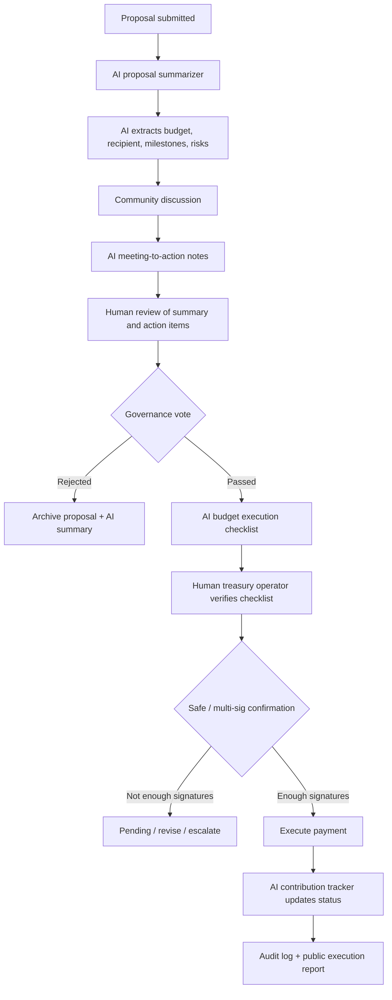

# Week 2 Module G - DAO Budget Execution Checklist Workflow

## 1. 选择的 DAO / 社区流程

我选择的流程是：

```text
DAO budget execution checklist
```

场景：

一个 DAO 通过治理流程给某个 AI x Web3 项目拨款。项目方提交 proposal，DAO 成员讨论，治理投票通过后，treasury multi-sig 或 Safe 执行付款。AI 可以辅助总结、检查、拆解和追踪，但不能替代治理判断、投票和签名。

这个流程和我 Week 2 主线 **Wallet / Permission / Safe Execution** 有直接关系：DAO treasury 的预算执行本质上也是高风险链上动作，必须有权限边界、人工确认、治理记录和审计证据。

## 2. 流程图



## 3. AI 可以辅助的步骤

| 步骤 | AI 可以做什么 | 输出 |
| --- | --- | --- |
| Proposal intake | 读取 proposal，提取目标、预算、时间线、收款方、风险 | Proposal summary |
| Discussion support | 总结社区讨论、争议点、未回答问题 | Discussion summary |
| Meeting notes | 从会议纪要中提取 action items 和 owner | Meeting-to-action list |
| Budget checklist | 检查金额、token、recipient、milestone、付款条件 | Budget execution checklist |
| Risk review | 标记新收款方、超预算、缺少 milestone、缺少审计 | Risk flags |
| Contribution tracking | 跟踪 deliverable、commit、PR、报告、demo 链接 | Contribution tracker |
| Reporting | 生成公开执行报告草稿 | Execution report draft |

## 4. 必须由人或治理流程确认的步骤

| 步骤 | 为什么必须人工 / 治理确认 |
| --- | --- |
| 是否资助 proposal | 这是价值判断和资源分配，不能由 AI 决定 |
| 预算是否合理 | AI 可以比较和提示，但最终判断属于社区 |
| milestone 是否接受 | 需要项目负责人和 reviewer 确认 |
| 收款地址是否正确 | 涉及资金安全，必须由 treasury operator 验证 |
| 是否执行付款 | 必须由 multi-sig / Safe signer 确认 |
| 是否追加预算 | 会扩大资金风险，必须重新走治理或授权流程 |
| 是否认定交付完成 | AI 可以汇总证据，但最终验收需要人确认 |
| 是否处理争议 | 涉及责任和价值判断，需要治理流程 |

## 5. Budget Execution Checklist 草图

### 输入

```json
{
  "proposalUrl": "https://forum.example.org/proposal/123",
  "proposalTitle": "Fund SafePay Execution Agent prototype",
  "requestedBudget": {
    "amount": "5000",
    "asset": "USDC",
    "chain": "base"
  },
  "recipient": "0xProjectTreasury",
  "milestones": [
    {
      "id": "M1",
      "description": "Runnable x402 + CAW payment demo",
      "amount": "1500",
      "evidence": ["GitHub repo", "demo video", "audit log"]
    },
    {
      "id": "M2",
      "description": "Agent wallet risk model and policy simulator",
      "amount": "2000",
      "evidence": ["threat model", "attack simulation report"]
    },
    {
      "id": "M3",
      "description": "Final writeup and community presentation",
      "amount": "1500",
      "evidence": ["final report", "presentation link"]
    }
  ]
}
```

### AI 生成的 checklist

```markdown
## Budget Execution Checklist

### Proposal Summary

- Proposal: Fund SafePay Execution Agent prototype
- Requested amount: 5000 USDC
- Chain: Base
- Recipient: 0xProjectTreasury
- Payment style: milestone-based
- Main risk: treasury payment should not be executed before milestone evidence is reviewed

### Checks

- [ ] Governance vote passed
- [ ] Recipient address verified by at least 2 humans
- [ ] Token and chain verified
- [ ] Milestone amount matches proposal
- [ ] Deliverable evidence reviewed
- [ ] Conflict of interest checked
- [ ] Safe transaction simulation passed
- [ ] Multi-sig threshold met
- [ ] Tx hash recorded
- [ ] Public execution report posted
```

## 6. 标注：AI 总结 vs 人工 / 治理确认

| 内容 | 类型 | 说明 |
| --- | --- | --- |
| Proposal summary | AI 总结 | AI 可以总结目标、预算和 milestone，但可能遗漏语境 |
| Risk flags | AI 总结 | AI 可以提示风险，但不是最终风险裁决 |
| Discussion summary | AI 总结 | AI 可以归纳观点，但不能代表社区共识 |
| Meeting action items | AI 总结 + 人工确认 | AI 可提取 owner 和 deadline，需要会议参与者确认 |
| Budget checklist | AI 生成草稿 | treasury operator 必须逐项确认 |
| Governance vote result | 治理流程确认 | 必须来自 Snapshot / Tally / onchain vote 等可信来源 |
| Recipient address | 人工确认 | 至少双人确认，最好通过 ENS / previous tx / signed message |
| Milestone acceptance | 人工确认 | reviewer 或工作组确认交付质量 |
| Safe transaction | 人工确认 | multi-sig signer 确认并签名 |
| Final payment execution | 治理 / multi-sig 确认 | AI 不应自动执行 DAO treasury 支付 |

## 7. Workflow 组件设计

### Component 1: Proposal Summarizer

作用：将 proposal 转成结构化摘要。

输出：

```json
{
  "summaryType": "ai_generated",
  "proposalGoal": "Fund SafePay Execution Agent prototype",
  "requestedBudget": "5000 USDC",
  "recipient": "0xProjectTreasury",
  "milestones": ["M1", "M2", "M3"],
  "openQuestions": [
    "Has the recipient address been verified?",
    "Who reviews milestone completion?",
    "What happens if M2 is delayed?"
  ]
}
```

标注：这是 AI 总结，不能作为治理结果。

### Component 2: Meeting-to-Action Workflow

作用：将会议记录转成行动项。

输出：

```json
{
  "summaryType": "ai_generated_needs_human_review",
  "actions": [
    {
      "owner": "Treasury working group",
      "task": "Verify recipient address",
      "deadline": "before Safe transaction creation",
      "requiresHumanConfirmation": true
    },
    {
      "owner": "Reviewer group",
      "task": "Review M1 demo evidence",
      "deadline": "before first payment",
      "requiresHumanConfirmation": true
    }
  ]
}
```

标注：AI 可以抽取 action，但 owner 和 deadline 必须由人确认。

### Component 3: Contribution Tracker

作用：跟踪项目交付证据。

字段：

- deliverable；
- GitHub commit / PR；
- demo link；
- audit log；
- reviewer；
- status；
- accepted by。

标注：AI 可以收集证据，但 milestone 是否完成需要 reviewer 确认。

### Component 4: Budget Execution Checklist

作用：在付款前做最后检查。

关键规则：

- 没有治理通过记录，不生成付款交易；
- recipient 未确认，不生成付款交易；
- milestone 未验收，不建议付款；
- Safe simulation 失败，不建议付款；
- tx hash 和执行报告必须公开记录。

标注：AI 可以生成 Safe transaction draft，但不能替 signer 签名。

## 8. 风险边界

| 风险 | AI 可做 | 必须由人 / 治理做 |
| --- | --- | --- |
| AI 总结错误 | 标记引用来源、保留原文链接 | reviewer 校对 |
| 社区共识被误读 | 总结不同观点 | 治理投票确认 |
| 收款地址错误 | 标记新地址 / 地址变化 | 双人确认或签名确认 |
| 预算超支 | 提示超预算 | governance re-approval |
| 交付质量争议 | 汇总证据 | reviewer / arbitration 决定 |
| Safe 交易风险 | simulation 和 checklist | signer 最终确认 |
| 自动付款滥用 | policy 建议 | treasury guard / Safe policy enforcement |

## 9. 最小可实现版本

最小 MVP 可以是一个 repo workflow：

```text
proposal.md
meeting-notes.md
deliverables/
budget-checklist.md
execution-report.md
```

AI 负责：

- 读取 proposal；
- 生成 summary；
- 从 meeting notes 提取 action；
- 从 deliverables 生成 contribution tracker；
- 生成 budget checklist；
- 写 execution report 草稿。

人 / 治理负责：

- 确认 summary；
- 投票；
- 验收 milestone；
- 确认 recipient；
- 签 Safe；
- 发布最终报告。

## 10. 结论

DAO / 社区流程里，AI 最适合做：

```text
summarize, structure, remind, compare, flag risk, draft report
```

但不适合直接做：

```text
decide, approve, sign, transfer, settle disputes
```

我认为最合理的边界是：

> AI 可以提高 DAO 的信息处理效率，但资金执行、治理判断和最终责任必须留在人和治理流程手里。

这和 Week 2 的 Wallet / Permission / Safe Execution 主线一致：AI 辅助执行，但权限、预算、签名和撤销必须由可验证的治理和钱包机制约束。

